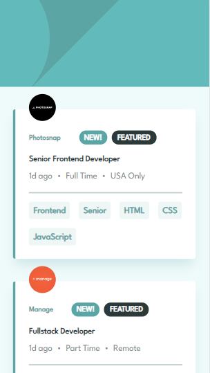
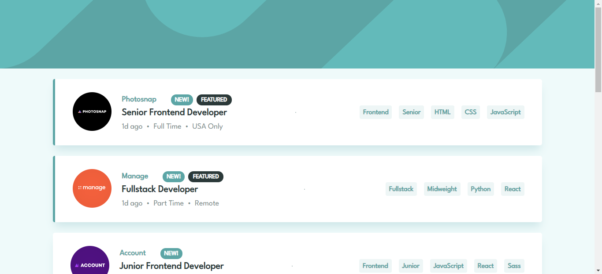

# Frontend Mentor - Job listings with filtering solution

This is a solution to the [Job listings with filtering challenge on Frontend Mentor](https://www.frontendmentor.io/challenges/job-listings-with-filtering-ivstIPCt). Frontend Mentor challenges help you improve your coding skills by building realistic projects. 

Created whit create-react-app.

### Install all dependencies

```
npm install
```

## Start the project

```
npm start
```

## Table of contents

- [Overview](#overview)
  - [The challenge](#the-challenge)
  - [Screenshot](#screenshot)
  - [Links](#links)
- [My process](#my-process)
  - [Built with](#built-with)
  - [Continued development](#continued-development)
- [Author](#author)

## Overview

### The challenge

Users should be able to:

- View the optimal layout for the site depending on their device's screen size
- See hover states for all interactive elements on the page
- Filter job listings based on the categories

### Screenshots




### Links

- Solution URL: [Code](https://github.com/JimAxl1/job-list-app)
- Live Site URL: [Demo](https://job-list-app-f837c.web.app)

## My process

### Built with

- Semantic HTML5 markup
- CSS
- Sass
- [React](https://reactjs.org/) - JS library
- React SOLID principles

### Continued development

I would like to improve in code, be a better developer and learn more tools about frontend.

## Author

- Frontend Mentor - [@JimAxl1](https://www.frontendmentor.io/profile/JimAxl1)
- Github - [@JimAxl1](https://github.com/JimAxl1)